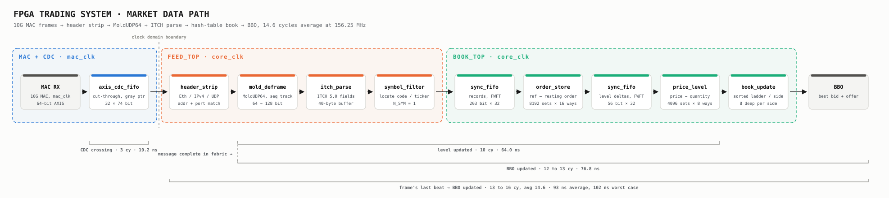

# FPGA Trading System

A hardware path from 10 Gigabit Ethernet to a live top-of-book quote. Frames come
in from the MAC, the best bid and offer for a watched symbol comes out **12 cycles
(76.8 ns) after the message that moved it is complete in the fabric**, with zero
jitter. No soft core anywhere on the path, and nothing is buffered a whole frame
at a time.

Target is a Kria KR260 (`xck26-sfvc784-2LV-c`) at 156.25 MHz, the clock a 10G MAC
hands over on a 64-bit datapath. One cycle is 6.4 ns.

## Pipeline



`feed_top` is the Ethernet-through-filter half; `book_top` wraps it with the book
stages and is the synthesis top.

## Stages

| Module | Does | Sizing |
|---|---|---|
| `axis_cdc_fifo` | MAC clock to core clock, gray pointers, two-flop synchronisers | 32 beats × 74 bit |
| `header_strip` | Checks MAC, EtherType, version/IHL, fragment flags, protocol, address, port; realigns UDP payload by 2 bytes | 6-beat header walk |
| `mold_deframe` | MoldUDP64 header, length-prefixed message walk, session sequence tracking | 64 → 128 bit |
| `itch_parse` | Field extraction by constant slice from a byte-reversed buffer | 40-byte buffer |
| `symbol_filter` | Learns locate code from directory or first add, matches on either after | `N_SYM = 1` |
| `order_store` | ref → resting order, emits a signed delta at a price | 8192 sets × 16 ways |
| `price_level` | Accumulates deltas into resting quantity per price | 4096 sets × 8 ways |
| `book_update` | Sorted ladder, best first, emits only when slot 0 moved | 8 deep per side |

ITCH types acted on: `A` add (36 bytes), `F` add with attribution (40), `E`
executed (31), `C` executed with price (36), `X` cancel (23), `D` delete (19),
`U` replace (35), `R` directory (39). Everything else is dropped at the parser.

A replace is two passes through `order_store`, the delete of the old ref, then
the insert of the new one, and emits two records. The store walks every set
clearing UltraRAM after reset before asserting `ready`, which costs 8192 cycles.

`price_level` stores the whole key, so a match is exact and the hash only has to
spread. ITCH prices are multiples of 100 in the wire encoding, so folding the key
beats using the low bits, which would leave most sets empty.

## Clock domains

The MAC recovers its clock from the wire; the book runs on a local oscillator.
Both are nominally 156.25 MHz and neither is the other, so `axis_cdc_fifo` sits
between them: gray-coded pointers with two-flop synchronisers each way, one
pointer bit changing per beat, so a synchroniser can only resolve to the old
value or the new one.

It is **cut-through, not store-and-forward**. A beat is visible to the read side
as soon as its write pointer update has crossed, measured at 3 read cycles.

## Backpressure and loss

`feed_top` has no ready signal, once a frame is on the wire it is coming whether
the book is busy or not, and `order_store` cannot pause its own output either.
Both `sync_fifo` instances exist for that: they absorb the case where the next
stage is stalled on an index collision or the second beat of a replace.

Every loss latches `book_stale`, held until software resynchronises from a
snapshot and pulses `resync`:

| Condition | Meaning |
|---|---|
| `gap_pulse` | Sequence gap, packets lost upstream |
| `cdc_fifo_ovf` | CDC FIFO overran |
| `rec_fifo_ovf` / `lvl_fifo_ovf` | Record or level FIFO overran |
| `store_ovf` / `lvl_ovf` | Set overflow in either hash table |

## Latency

From `tb_book_top`, driving real capture frames and timing them with a timestamp
queue riding alongside the data.

| Segment | Cycles | ns |
|---|---|---|
| CDC crossing, write accepted to read visible | 3 | 19.2 |
| Message complete in fabric to level updated | 10 | 64.0 |
| **Message complete in fabric to BBO updated** | **12** | **76.8** |

Jitter on the last figure is zero cycles across the run. Nothing in the book half
is data dependent while the FIFOs stay shallow, and at a four-cycle record
spacing they stay empty.

## Verification

Every stage has a golden model in Python and a self-checking bench. The models
are structural, not behavioural, `order_store_model.py` and the level table in
`book_model.py` reproduce the real sets, ways, tags and allocation rules, so they
predict set overflow and way occupancy and check the sizing decisions rather than
only the semantics.

Vectors are built from a real NASDAQ ITCH 5.0 session capture.
`mold_packetize.py` groups messages into MoldUDP64 packets, `eth_encapsulate.py`
wraps them in UDP, IPv4 and Ethernet, and each stage's expected output is
generated from the previous stage's, so a stage is always compared against what
actually reached it.

## Running

Vectors first, from a capture:

```sh
python scripts/mold_packetize.py <itch file>
python scripts/eth_encapsulate.py
python golden/order_store_model.py
python golden/book_model.py
```

Under Vivado:

```sh
vivado -mode batch -source scripts/sim.tcl -tclargs tb_book_top
vivado -mode batch -source scripts/build.tcl -tclargs book_top 6.4
```

`sim.tcl` copies the vectors it needs into an out-of-tree work directory, prints
`SIM RESULT: PASS` or `FAIL`, and distinguishes a failing check from the
simulator never starting. `build.tcl` runs out-of-context synthesis and writes
utilisation, timing and CDC reports.

Under Icarus, out of tree so the VCD does not land in the repo:

```sh
export PATH=/path/to/oss-cad-suite/bin:$PATH
cd <scratch dir>
iverilog -g2012 -o sim.vvp <rtl files> <repo>/tb/unit/<tb>.sv
vvp sim.vvp
```

Icarus handles the dual-clock stimulus but has no concurrent assertion support.
Use Verilator for lint and SVA.

## Layout

| Path | Contents |
| --- | --- |
| `rtl/common/` | `axis_cdc_fifo`, `sync_fifo` |
| `rtl/eth/` | `header_strip`, `mold_deframe` |
| `rtl/itch/` | `itch_parse`, `symbol_filter` |
| `rtl/book/` | `order_store`, `price_level`, `book_update` |
| `rtl/top/` | `feed_top`, `book_top` |
| `tb/unit/` | One bench per module |
| `tb/vectors/` | Generated, gitignored |
| `golden/` | Python reference models |
| `scripts/` | Vector generation, sim and synthesis flows |
